# Phân tích quy trình và kết quả kiểm chứng

Tài liệu này gom phần giải thích quy trình, công thức, cách đo và kết quả cuối cùng của giai đoạn tính toán chỉ số và prototype định tuyến tĩnh. Thành phần `ZT-SR-VI` trong giai đoạn này dùng để kiểm chứng action mask, reward và lựa chọn đường theo nguyên mẫu/value-iteration; chưa được trình bày như một hệ DRL đã huấn luyện hoàn chỉnh.

## 1. Quy trình xử lý tổng thể

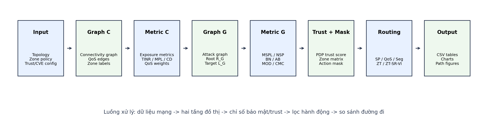

Luồng xử lý hiện tại gồm 8 bước:

1. Nhập topology, zone policy, trust config và CVE/CVSS config.
2. Dựng graph kết nối `C`, trong đó node có zone và edge có QoS.
3. Tính chỉ số trên `C`, gồm exposure/độ dài đường đi và trọng số QoS.
4. Dựng graph tấn công `G` từ thông tin topology, zone và CVE.
5. Tính chỉ số trên `G`, gồm `MSPL`, `NSP`, `BN`, `AB`, `MOD`, `CMC`.
6. Tính trust score, áp dụng zone matrix và sinh action mask.
7. Chạy các baseline định tuyến: `SP-Routing`, `QoS-Routing`, `Seg-Routing`, `ZT-Routing`, `ZT-SR-VI`.
8. Xuất CSV, biểu đồ và hình đường đi để đối chiếu.

Điểm quan trọng là `C` và `G` không thay thế nhau. `C` dùng để định tuyến thật trên topology kết nối, còn `G` dùng để đo rủi ro khai thác và chokepoint bảo mật. Kết quả từ `G` được đưa ngược vào phần lọc hoặc reward để tác động đến lựa chọn đường trên `C`.

## 2. Hai tầng đồ thị C và G

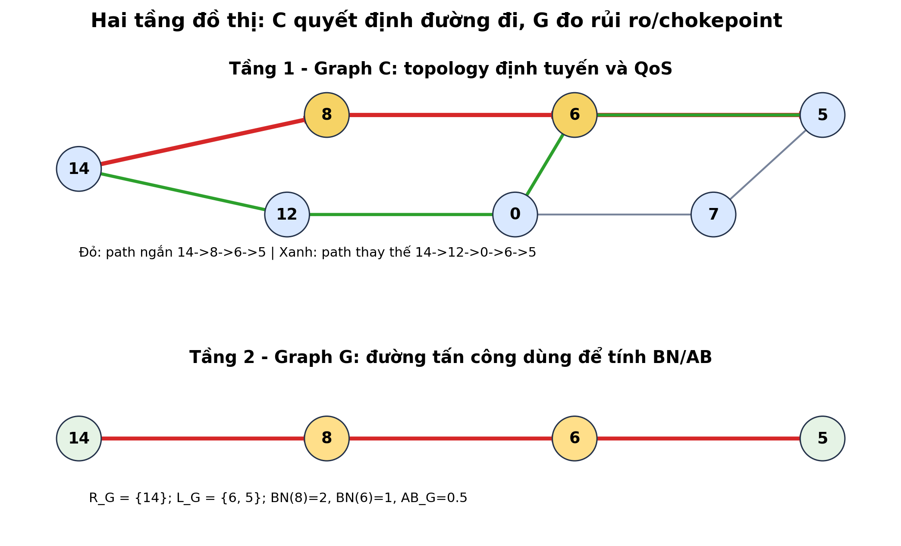

Trong kịch bản kiểm chứng chính, flow định tuyến là `14 -> 5`.

Graph `C` thể hiện các đường có thể đi:

- Đường ngắn theo latency/topology: `14 -> 8 -> 6 -> 5`.
- Đường thay thế tránh chokepoint hơn: `14 -> 12 -> 0 -> 6 -> 5`.
- Đường tránh node `6` khi trust của node này bị giảm: `14 -> 12 -> 0 -> 7 -> 5`.

Graph `G` của ca kiểm chứng được đặt có chủ đích:

- `R_G = {14}`: node gốc tấn công.
- `L_G = {6, 5}`: node đặc quyền hoặc mục tiêu cần bảo vệ.
- Shortest attack paths:
  - `14 -> 8 -> 6`
  - `14 -> 8 -> 6 -> 5`

Vì vậy node `8` và `6` nằm ở giữa các đường tấn công theo đúng nghĩa `BN`, giúp kết quả không còn bị rơi về 0 như flow cũ `14 -> 7`.

## 3. Công thức đo QoS

Mỗi edge `(u, v)` trong graph `C` có các trường chính:

- `delay_ms(u, v)`: độ trễ của link.
- `bandwidth_mbps(u, v)`: băng thông link.
- `loss_rate(u, v)`: tỉ lệ mất gói nếu topology có khai báo.

Trọng số QoS đang dùng trong benchmark:

```text
qos_weight(u, v) = delay_ms(u, v) + 1000 / bandwidth_mbps(u, v)
```

Nếu `bandwidth_mbps = 0`, link được xem là không hoạt động và `qos_weight = inf`.

Với một path `P = [n0, n1, ..., nk]`:

```text
delay_path(P) = tổng delay_ms(ni, ni+1)
qos_weight_path(P) = tổng qos_weight(ni, ni+1)
bandwidth_path(P) = min bandwidth_mbps(ni, ni+1)
hops(P) = số edge trên path
```

Ví dụ trong trạng thái `NORMAL`:

- Path `14 -> 8 -> 6 -> 5`
- `Delay_ms = 38.259117`
- `Bandwidth_Mbps = 150`
- `Hops = 3`
- `QoS_weight = 53.592450`

Trong trạng thái `BW_CONGESTION`, edge `14 -> 8` bị hạ băng thông xuống `10 Mbps`. Khi đó path cũ vẫn có delay thấp, nhưng `QoS_weight` tăng lên `146.925784`, nên `QoS-Routing` chuyển sang path `14 -> 12 -> 0 -> 6 -> 5` có `QoS_weight = 125.633615`.

## 4. Công thức trust và action mask

Trust score của một node được tính theo ba thành phần:

```text
T(n) = 0.4 * I(n) + 0.3 * B(n) + 0.3 * Ctx(n)
```

Trong đó:

- `I(n)`: điểm identity.
- `B(n)`: điểm behavior.
- `Ctx(n)`: điểm context.

Một node vượt điều kiện trust nếu:

```text
T(n) >= theta_path
```

Trong kịch bản `TRUST_DEGRADED`, node `6` bị giảm behavior:

```text
I(6) = 1.0
B(6) = 0.3
Ctx(6) = 1.0
T(6) = 0.4 * 1.0 + 0.3 * 0.3 + 0.3 * 1.0 = 0.79
```

Ngưỡng cố định của flow là `theta_path = 0.90`, nên node `6` không đạt trust. Kết quả:

- `SP-Routing` và `QoS-Routing` vẫn có thể đi qua `6` vì không xét trust.
- `ZT-Routing` tránh node `6` và chọn `14 -> 12 -> 0 -> 7 -> 5`.
- `ZT-SR-VI` bị `DENIED/BLOCKED` vì sau khi kết hợp zone policy, trust mask và structural/action mask thì không còn đường hợp lệ.

## 5. Công thức BN và AB

`BN(n)` không được tính bằng cách lấy tổng số path qua node `n` chia cho tổng số path toàn mạng. Công thức đúng phải tính theo từng cặp nguồn-đích trong attack graph:

```text
BN(n) = tổng với r thuộc R_G, l thuộc L_G của NSP_rl(n) / NSP_rl
```

Trong đó:

- `NSP_rl`: số shortest paths từ root `r` đến target `l`.
- `NSP_rl(n)`: số shortest paths từ `r` đến `l` có node `n` nằm ở giữa.
- Node `n` không được tính nếu nó là endpoint của cặp đang xét.

`AB_G` là chỉ số cấp mạng trên graph `G`:

```text
AB_G = (1 / |L_G|) * tổng BN(l) với l thuộc L_G
```

Với graph kiểm chứng:

```text
R_G = {14}
L_G = {6, 5}
Edges G = 14->8, 8->6, 6->5
```

Tính từng bước:

| Cặp `r -> l` | Shortest path | Node xét | Vai trò node | Đóng góp |
|---|---|---:|---|---:|
| `14 -> 6` | `14 -> 8 -> 6` | `8` | nằm giữa | `1/1 = 1` |
| `14 -> 6` | `14 -> 8 -> 6` | `6` | target endpoint | `0` |
| `14 -> 5` | `14 -> 8 -> 6 -> 5` | `8` | nằm giữa | `1/1 = 1` |
| `14 -> 5` | `14 -> 8 -> 6 -> 5` | `6` | nằm giữa | `1/1 = 1` |
| `14 -> 5` | `14 -> 8 -> 6 -> 5` | `5` | target endpoint | `0` |

Kết quả:

```text
BN(8) = 1 + 1 = 2
BN(6) = 0 + 1 = 1
BN(5) = 0
AB_G = (BN(6) + BN(5)) / 2 = (1 + 0) / 2 = 0.5
```

Với path `14 -> 8 -> 6 -> 5`:

```text
Avg_BN_on_path = (BN(14) + BN(8) + BN(6) + BN(5)) / 4
               = (0 + 2 + 1 + 0) / 4
               = 0.75
```

Với path thay thế `14 -> 12 -> 0 -> 6 -> 5`, node `12` và `0` không nằm trong graph `G` kiểm chứng nên `BN(12)=0`, `BN(0)=0`. Khi đó:

```text
Avg_BN_on_path = (BN(14) + BN(12) + BN(0) + BN(6) + BN(5)) / 5
               = (0 + 0 + 0 + 1 + 0) / 5
               = 0.20
```

CSV đối chiếu trực tiếp:

- [`zt_sr_sdwan/results/calculations/bn_ab_controlled_demo.csv`](../zt_sr_sdwan/results/calculations/bn_ab_controlled_demo.csv)
- [`zt_sr_sdwan/results/calculations/bn_ab_validation_summary.csv`](../zt_sr_sdwan/results/calculations/bn_ab_validation_summary.csv)
- [`zt_sr_sdwan/results/calculations/final_baseline_statistics_validation_flow.csv`](../zt_sr_sdwan/results/calculations/final_baseline_statistics_validation_flow.csv)

## 6. Kịch bản benchmark chính

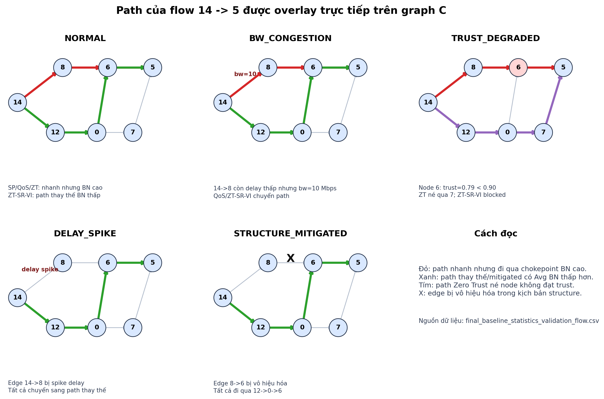

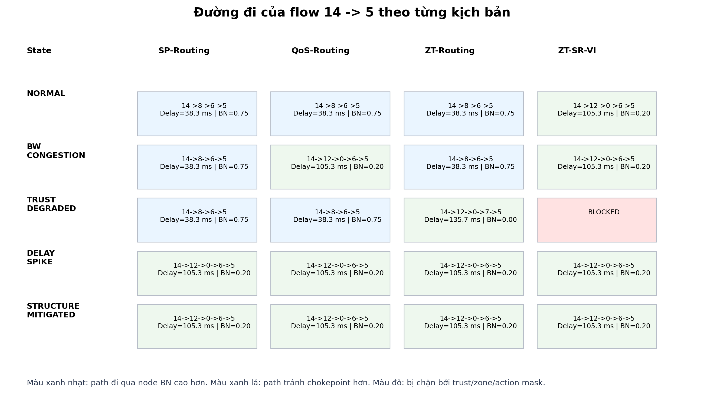

Flow đo chính:

```text
source = 14
target = 5
```

Bảng dưới đây là phần rút gọn từ CSV cuối cùng:

| State | Baseline | Status | Path | Delay ms | Min trust | Avg BN |
|---|---|---|---|---:|---:|---:|
| `NORMAL` | `SP/QoS/ZT` | `ACTIVE` | `14->8->6->5` | `38.259` | `0.985` | `0.75` |
| `NORMAL` | `ZT-SR-VI` | `ACTIVE` | `14->12->0->6->5` | `105.300` | `0.985` | `0.20` |
| `BW_CONGESTION` | `QoS/ZT-SR-VI` | `ACTIVE` | `14->12->0->6->5` | `105.300` | `0.985` | `0.20` |
| `TRUST_DEGRADED` | `ZT-Routing` | `ACTIVE` | `14->12->0->7->5` | `135.706` | `0.985` | `0.00` |
| `TRUST_DEGRADED` | `ZT-SR-VI` | `DENIED/BLOCKED` | rỗng | `inf` | `0.000` | `0.00` |
| `DELAY_SPIKE` | tất cả baseline | `ACTIVE` | `14->12->0->6->5` | `105.300` | `0.985` | `0.20` |
| `STRUCTURE_MITIGATED` | tất cả baseline | `ACTIVE` | `14->12->0->6->5` | `105.300` | `0.985` | `0.20` |

Ý nghĩa từng state:

- `NORMAL`: đường ngắn `14->8->6->5` có delay tốt nhất nhưng đi qua chokepoint `8` và `6`, nên `Avg_BN_on_path = 0.75`. `ZT-SR-VI` chọn đường thay thế có `Avg_BN_on_path = 0.20`.
- `BW_CONGESTION`: băng thông edge `14->8` bị hạ xuống `10 Mbps`, làm QoS cost của đường ngắn tăng. `QoS-Routing` và `ZT-SR-VI` chọn đường thay thế.
- `TRUST_DEGRADED`: node `6` giảm trust xuống `0.79`. `ZT-Routing` né node `6`; `ZT-SR-VI` bị chặn vì các lớp mask không còn cho ra path hợp lệ.
- `DELAY_SPIKE`: edge `14->8` bị spike delay, nên tất cả baseline chuyển sang `14->12->0->6->5`.
- `STRUCTURE_MITIGATED`: edge `8->6` bị vô hiệu hóa để mô phỏng giảm phụ thuộc vào chokepoint, nên tất cả baseline bắt buộc đi đường thay thế.

## 7. Biểu đồ kết quả

Các biểu đồ này được tạo lại từ CSV kết quả, dùng bản public trong `zt_sr_sdwan/results/visualizations/`. Thư mục `presentation/figs/` chỉ là bản dựng phục vụ slide cục bộ và đang bị loại khỏi Git.

### 7.1. So sánh delay

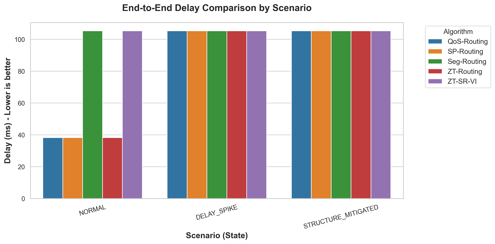

Delay thấp nhất trong `NORMAL` thuộc về path `14->8->6->5`. Khi có `DELAY_SPIKE` hoặc `STRUCTURE_MITIGATED`, các baseline chuyển sang path thay thế `14->12->0->6->5`, delay tăng lên nhưng tránh được cạnh bị tác động.

### 7.2. So sánh bandwidth

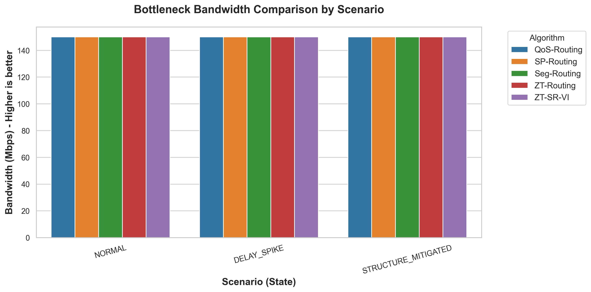

Trong `BW_CONGESTION`, bottleneck bandwidth của path qua `14->8` giảm xuống `10 Mbps`. Đây là lý do `QoS-Routing` đổi đường dù path đó vẫn có số hop thấp hơn.

### 7.3. So sánh trust

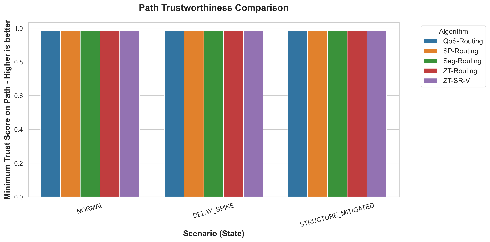

Ở `TRUST_DEGRADED`, các path đi qua node `6` có `Min_Trust = 0.79`. Path của `ZT-Routing` né node `6` nên giữ được `Min_Trust = 0.985`.

## 8. Hình topology và feasible graph

Graph kết nối `C`:

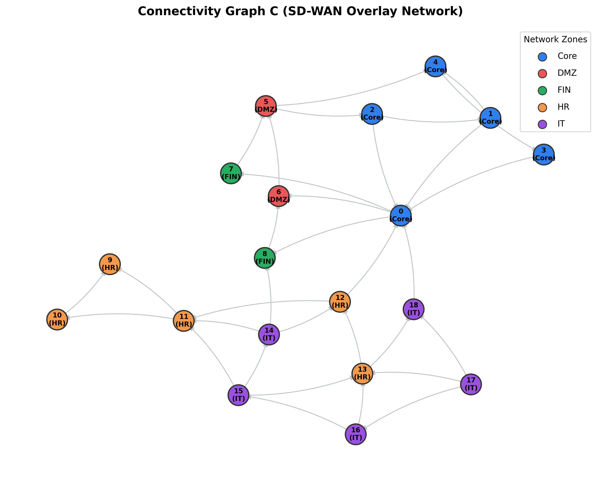

Graph tấn công `G`:

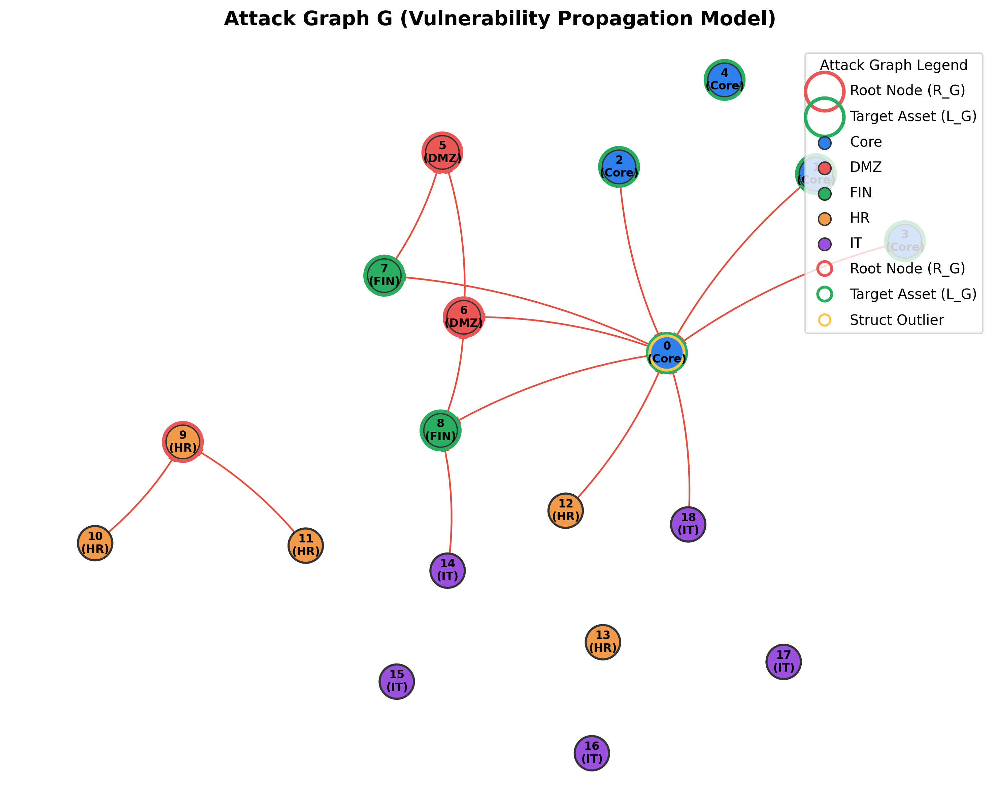

Feasible graph sau khi áp dụng zone/trust/action mask:

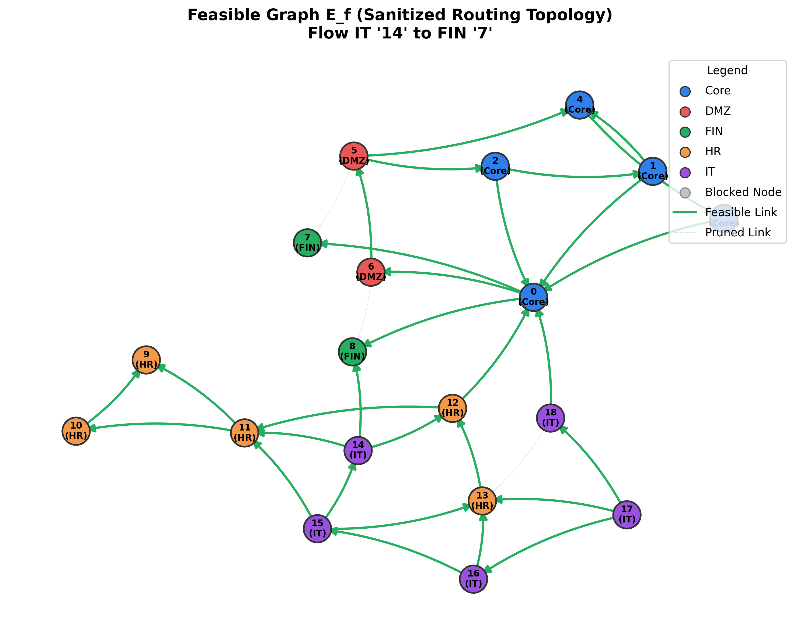

Hình đường đi:

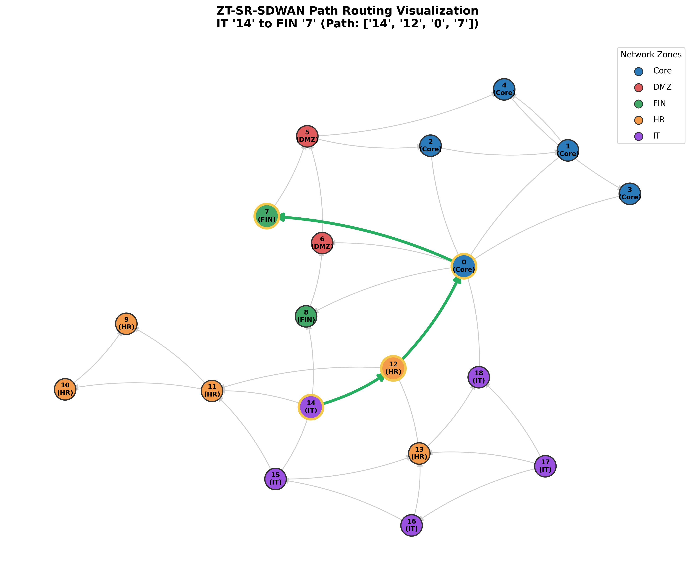

Các hình này dùng để kiểm tra trực quan rằng kết quả CSV không phải số rời rạc. Một path trong bảng phải khớp với edge còn hoạt động trong `C`, node/edge còn được phép trong feasible graph, và rủi ro/chokepoint trong `G`.

## 9. File CSV cần đọc khi kiểm chứng

Các file CSV chính:

| File | Nội dung kiểm chứng |
|---|---|
| [`final_baseline_statistics_validation_flow.csv`](../zt_sr_sdwan/results/calculations/final_baseline_statistics_validation_flow.csv) | Bảng cuối cùng so sánh tất cả baseline theo flow `14 -> 5`. |
| [`baseline_comparison_by_state.csv`](../zt_sr_sdwan/results/calculations/baseline_comparison_by_state.csv) | Bảng benchmark tổng quát theo state. |
| [`qos_edge_metrics_by_state.csv`](../zt_sr_sdwan/results/calculations/qos_edge_metrics_by_state.csv) | Delay, bandwidth, loss và QoS weight của từng edge. |
| [`routing_path_edge_breakdown_by_state.csv`](../zt_sr_sdwan/results/calculations/routing_path_edge_breakdown_by_state.csv) | Tách từng edge trong path, gồm cumulative delay, bottleneck bandwidth và reward component. |
| [`trust_node_scores_and_masks_by_state.csv`](../zt_sr_sdwan/results/calculations/trust_node_scores_and_masks_by_state.csv) | Identity, behavior, context, trust score, theta và mask của từng node. |
| [`feasible_edges_by_state.csv`](../zt_sr_sdwan/results/calculations/feasible_edges_by_state.csv) | Edge nào còn hợp lệ sau zone policy, trust mask và node mask. |
| [`robustness_node_metrics_by_state.csv`](../zt_sr_sdwan/results/calculations/robustness_node_metrics_by_state.csv) | BN, MOD và cờ structural pass theo node. |
| [`robustness_bn_pair_contributions_by_state.csv`](../zt_sr_sdwan/results/calculations/robustness_bn_pair_contributions_by_state.csv) | Đóng góp BN theo từng cặp `r -> l`, dùng để tránh hiểu sai công thức BN. |
| [`bn_ab_controlled_demo.csv`](../zt_sr_sdwan/results/calculations/bn_ab_controlled_demo.csv) | Ca kiểm chứng có `BN` và `AB_G` khác 0, tách từng bước tính. |

## 10. Cách tái tạo kết quả

Từ thư mục `zt_sr_sdwan`:

```bash
python scripts/export_calculation_csvs.py
```

Từ thư mục gốc:

```bash
python generate_plots.py
python zt_sr_sdwan/scripts/generate_explanatory_diagrams.py
```

Sau đó kiểm tra:

- CSV ở `zt_sr_sdwan/results/calculations/`.
- Biểu đồ benchmark ở `zt_sr_sdwan/results/visualizations/`.
- Hình giải thích quy trình ở `docs/assets/`.
