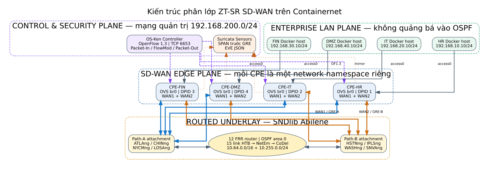
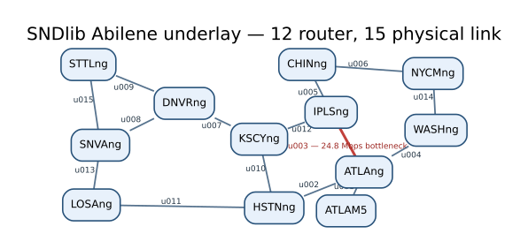
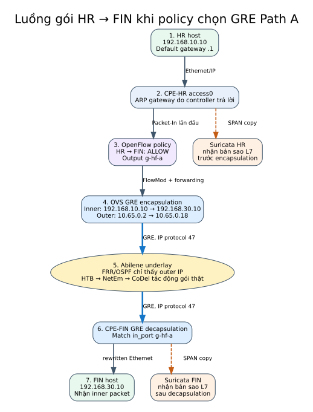

# Baseline underlay và kiến trúc ZT-SR SD-WAN

Tài liệu này mô tả mạng đang được xây dựng theo ba câu hỏi: dữ liệu đầu vào
đến từ đâu, Linux thực thi các tham số đó như thế nào, và gói tin thật đi qua
hệ thống theo đường nào. Underlay và overlay được trình bày riêng để tránh
nhầm một topology mô phỏng bằng số với một mạng packet-level có forwarding
thật.

## 1. Trạng thái hiện tại

Underlay Abilene đã được triển khai và đã vượt qua một lần kiểm chứng đầy đủ.
Điều đó có nghĩa là các router Docker đã trao đổi route bằng OSPF và packet
thật đã đi qua các cặp veth chịu tác động của Linux traffic control. Mạng
không chạy thường trực sau khi chương trình kết thúc; mỗi lần chạy script,
Containernet sẽ dựng lại cùng một topology từ cấu hình có kiểm soát.

Overlay đang ở giai đoạn triển khai mã nguồn. Cấu hình site, địa chỉ, hai WAN
cho mỗi CPE, sáu GRE tunnel, Dockerfile và controller OpenFlow 1.3 đã được
viết. Tuy nhiên, chưa được phép gọi phần này là “đã hoạt động” cho đến khi quá
trình build image và bài kiểm thử end-to-end bằng quyền root hoàn tất.

| Thành phần | Trạng thái | Bằng chứng hoặc điều kiện còn thiếu |
|---|---|---|
| 12 router và 15 link Abilene | Đã kiểm chứng | OSPF hội tụ; 132/132 phép ping loopback thành công |
| HTB → NetEm → CoDel | Đã kiểm chứng | Có đúng qdisc trên cả 30 hướng egress |
| Capacity và phản ứng nghẽn | Đã kiểm chứng | Throughput bị chặn ở bottleneck; RTT và loss tăng khi quá tải |
| D-ITG packet flow | Đã kiểm chứng | Receiver giải mã được 947 packet trong lần đo gần nhất |
| Bốn CPE OVS và tám WAN attachment | Đã viết cấu hình/runtime | Cần build image và chạy full deployment |
| Sáu GRE tunnel qua underlay | Đã viết cấu hình/runtime | Cần tcpdump outer GRE tại hai biên underlay |
| Default deny và steering HR/IT | Đã viết controller | Cần kiểm chứng flow table và ping allow/deny |
| SPAN Suricata và active probing | Đã viết runtime/controller | Cần kiểm chứng RX counter, EVE JSON và probe JSONL |

## 2. Kiến trúc tổng thể

Hệ thống gồm bốn mặt phẳng có ranh giới rõ ràng. Enterprise LAN chứa các
Docker host và dùng địa chỉ riêng. SD-WAN Edge chứa OVS CPE, là nơi thực thi
policy và đóng gói GRE. Routed underlay chỉ chuyển tiếp outer IP bằng OSPF.
Control and Security Plane truyền lệnh OpenFlow qua mạng quản trị độc lập và
nhận dữ liệu giám sát.



Các màu xanh dương và cam trong hình biểu diễn hai lựa chọn đường WAN độc
lập. Chúng không phải hai dây nối thẳng giữa CPE. Mỗi GRE tunnel dùng một cặp
outer IP; packet bọc ngoài phải được các router FRR chuyển tiếp qua topology
Abilene trước khi tới CPE bên kia.

Về mặt toán học, routed underlay là đồ thị có trọng số:

$$
G_U = \left(V_U, E_U\right),
$$

trong đó mỗi cạnh vật lý $e \in E_U$ được mô tả bởi bộ tham số:

$$
w_e = \left(C_e, d^{\mathrm{prop}}_e, Q_e\right).
$$

$C_e$ là capacity sau khi scale, $d^{\mathrm{prop}}_e$ là propagation delay
ước lượng cho một chiều, còn $Q_e$ là chuỗi qdisc thực thi trên Linux. Overlay
là một đồ thị logic khác:

$$
G_O = \left(V_{\mathrm{CPE}}, E_{\mathrm{GRE}}\right).
$$

Mỗi cạnh $t \in E_{\mathrm{GRE}}$ ánh xạ tới hai outer endpoint và một đường
đi trong $G_U$. Vì vậy, thay đổi queue hoặc capacity trong underlay sẽ tác
động trực tiếp tới packet của overlay; controller không tự vẽ ra delay hoặc
loss.

### 2.1. Hai pha bắt buộc phải tách biệt

Phương pháp triển khai có một pha cấu hình tĩnh và một pha đo lường động.
Hai pha cùng xuất hiện trong thí nghiệm nhưng không được dùng thay thế cho
nhau.

**Pha cấu hình hạ tầng** chạy trước `net.start()` hoặc ngay sau khi interface
được tạo. Haversine chỉ được dùng ở pha này để sinh đầu vào NetEm:

$$
d^{\mathrm{cfg}}_{\mathrm{prop},e}
= \frac{\alpha D^{\mathrm{geo}}_e}{v_f}\times 10^3.
$$

Ví dụ, nếu công thức cho $d^{\mathrm{cfg}}_{\mathrm{prop},e}=8\ \mathrm{ms}$,
chương trình nạp đúng `delay 8ms` vào TCLink/NetEm. Con số 8 ms là **giới hạn
vật lý được mô hình hóa**, không phải kết quả của lần chạy.

**Pha đo lường** chỉ bắt đầu sau khi topology đã start và traffic thật đã đi
qua interface. Các đại lượng kết quả được lấy từ công cụ quan sát runtime:

$$
d^{\mathrm{meas}}_{\text{one-way}}
= t^{\mathrm{recv}}_{\text{D-ITG}}
- t^{\mathrm{send}}_{\text{D-ITG}},
$$

$$
\mathrm{RTT}^{\mathrm{meas}}
= t^{\mathrm{probe\ reply}}-t^{\mathrm{probe\ send}},
$$

$$
\Delta N^{\mathrm{drop}}_e
= N^{\mathrm{drop}}_{e,\mathrm{after}}
- N^{\mathrm{drop}}_{e,\mathrm{before}}.
$$

Trong đó timestamp đến từ D-ITG hoặc active probe, còn counter drop đến từ
`tc -s -d qdisc`. `tcpdump` dùng để chứng minh packet xuất hiện ở đúng hop và
có thể đối chiếu timestamp khi capture ở hai điểm dùng chung clock host.

Repository cưỡng chế ranh giới này bằng cấu trúc artifact:

```text
runtime/.../configuration/   # input tĩnh; plot_eligible=false
runtime/.../measurements/    # quan sát packet/counter thật; plot_eligible=true
```

Mọi script vẽ đồ thị kết quả phải từ chối artifact `configuration`. Vì vậy
đường `configured propagation delay` có thể xuất hiện trong bảng cấu hình để
đối chứng, nhưng không được đổi tên thành measured delay hay được dùng làm
đường kết quả của thí nghiệm.

## 3. Topology routed underlay

Topology sử dụng đủ 12 node và 15 physical link của bộ Abilene trong SNDlib.
Đường màu đỏ `u003` là bottleneck 24,8 Mbps sau khi scale; các đường còn lại
có capacity 99,2 Mbps.



Bảng sau là chú giải đầy đủ cho từng link. Delay trong bảng là propagation
delay một chiều được cấu hình trên mỗi hướng egress, không phải RTT đo sẵn
trong SNDlib.

| Link | Hai đầu router | Capacity cấu hình | Propagation delay một chiều |
|---|---|---:|---:|
| `u001` | ATLAM5 — ATLAng | 99,2 Mbps | 1,36 ms |
| `u002` | ATLAng — HSTNng | 99,2 Mbps | 11,11 ms |
| `u003` | ATLAng — IPLSng | 24,8 Mbps | 6,07 ms |
| `u004` | ATLAng — WASHng | 99,2 Mbps | 9,26 ms |
| `u005` | CHINng — IPLSng | 99,2 Mbps | 2,67 ms |
| `u006` | CHINng — NYCMng | 99,2 Mbps | 11,79 ms |
| `u007` | DNVRng — KSCYng | 99,2 Mbps | 7,66 ms |
| `u008` | DNVRng — SNVAng | 99,2 Mbps | 15,59 ms |
| `u009` | DNVRng — STTLng | 99,2 Mbps | 16,17 ms |
| `u010` | HSTNng — KSCYng | 99,2 Mbps | 10,57 ms |
| `u011` | HSTNng — LOSAng | 99,2 Mbps | 22,57 ms |
| `u012` | IPLSng — KSCYng | 99,2 Mbps | 9,28 ms |
| `u013` | LOSAng — SNVAng | 99,2 Mbps | 5,18 ms |
| `u014` | NYCMng — WASHng | 99,2 Mbps | 3,45 ms |
| `u015` | SNVAng — STTLng | 99,2 Mbps | 11,69 ms |

Mỗi router là một Docker container chạy FRRouting. Các core link dùng subnet
`/30` lấy từ `10.64.0.0/16`; mỗi router còn có một loopback `/32` trong
`10.255.0.0/24`. OSPF area `0.0.0.0` học cả core subnet và loopback. Subnet
nối CPE sẽ được quảng bá dưới dạng passive network: router công bố route
nhưng không cố thiết lập OSPF adjacency với CPE.

## 4. Capacity được lấy và scale như thế nào

Capacity gốc được đọc từ trường `capacity` trong file XML SNDlib Abilene.
Đơn vị được kiểm tra là `MBITPERSEC`; chương trình sẽ dừng nếu checksum, đơn
vị hoặc provenance không đúng với cấu hình. Để topology chạy được trên một
máy cá nhân, capacity được chia cho hệ số $s_C = 100$:

$$
C^{\mathrm{emu}}_e = \frac{C^{\mathrm{SNDlib}}_e}{s_C}.
$$

Ví dụ, link có capacity gốc $9\,920\ \mathrm{Mbps}$ trở thành:

$$
C^{\mathrm{emu}}_e = \frac{9\,920}{100}
= 99{,}2\ \mathrm{Mbps}.
$$

Traffic demand cũng được chia cho cùng hệ số. Vì vậy mức sử dụng tương đối
của link được bảo toàn:

$$
\rho_e^{\mathrm{emu}}
= \frac{\lambda_e^{\mathrm{SNDlib}}/100}
       {C_e^{\mathrm{SNDlib}}/100}
= \frac{\lambda_e^{\mathrm{SNDlib}}}
       {C_e^{\mathrm{SNDlib}}}
= \rho_e^{\mathrm{SNDlib}}.
$$

Linux HTB là cơ chế thực sự áp giới hạn này. Khi ứng dụng gửi nhanh hơn
$C^{\mathrm{emu}}_e$, packet không thể rời interface nhanh hơn tốc độ đã cấu
hình; packet phải chờ trong queue hoặc bị AQM loại bỏ.

## 5. Propagation delay được suy ra như thế nào

SNDlib Abilene cung cấp topology, capacity và tọa độ node nhưng không cung
cấp một trường delay đo sẵn phù hợp cho từng link. Vì vậy, delay hiện tại là
một ước lượng vật lý có công thức và provenance rõ ràng, không phải giá trị
gán ngẫu nhiên. Với hai node có vĩ độ $\varphi_1, \varphi_2$ và kinh độ
$\lambda_1, \lambda_2$, khoảng cách đường tròn lớn được tính bằng Haversine:

$$
\Delta\varphi = \varphi_2 - \varphi_1,
\qquad
\Delta\lambda = \lambda_2 - \lambda_1,
$$

$$
a = \sin^2\!\left(\frac{\Delta\varphi}{2}\right)
  + \cos(\varphi_1)\cos(\varphi_2)
    \sin^2\!\left(\frac{\Delta\lambda}{2}\right),
$$

$$
D_e = 2R\arcsin\!\left(\sqrt{a}\right),
$$

với bán kính Trái Đất $R = 6\,371\ \mathrm{km}$. Đường cáp thực tế không đi
theo đường chim bay, nên khoảng cách được nhân stretch factor
$\alpha = 2{,}1$. Vận tốc lan truyền trong sợi quang được đặt là
$v_f = 204\,000\ \mathrm{km/s}$. Propagation delay một chiều là:

$$
d^{\mathrm{prop}}_e
= \frac{\alpha D_e}{v_f}\times 10^3
\quad \mathrm{ms}.
$$

NetEm áp $d^{\mathrm{prop}}_e$ lên packet thật khi packet rời interface. Công
thức này có cơ sở vật lý, nhưng vẫn phải được gọi đúng là **ước lượng địa
lý–sợi quang**, không phải số đo latency lịch sử của nhà mạng Abilene.

## 6. Queueing delay và packet loss phát sinh ở đâu

Trên mỗi hướng egress, Linux sử dụng chuỗi:

$$
\mathrm{HTB}\;\longrightarrow\;\mathrm{NetEm}
\;\longrightarrow\;\mathrm{CoDel}.
$$

Vai trò của từng tầng khác nhau:

- HTB đặt tốc độ phục vụ tối đa bằng capacity của link.
- NetEm thêm propagation delay nền đã tính ở phần trên.
- CoDel theo dõi thời gian packet nằm trong queue và chủ động drop khi queue
  duy trì trạng thái nghẽn lâu hơn target.

Cấu hình hiện tại dùng CoDel target 5 ms, interval 100 ms, queue limit 1.000
packet và không ép random loss. Với một đường đi $P$, delay quan sát có thể
viết thành:

$$
d_{\text{one-way}}(P,t)
= \sum_{e\in P} d^{\mathrm{prop}}_e
+ \sum_{e\in P} d^{\mathrm{queue}}_e(t)
+ d^{\mathrm{proc}}(t).
$$

Trong đó $d^{\mathrm{queue}}_e(t)$ phụ thuộc vào tải tại thời điểm $t$ và
không được gán trước. Khi offered load $\lambda_e(t)$ tiến sát hoặc vượt
$C_e$, queueing delay tăng; nếu tình trạng đó kéo dài, CoDel bắt đầu drop.
Packet loss quan sát vì thế là kết quả của nghẽn và AQM, không phải lệnh
`loss 2%` đặt cứng.

RTT đo bằng ping bao gồm cả chiều đi lẫn chiều về:

$$
\mathrm{RTT}(t)
= d_{\rightarrow}(t) + d_{\leftarrow}(t).
$$

Do đó bandwidth cao hơn không làm propagation delay giảm. Nó chỉ làm giảm
khả năng packet phải xếp hàng đối với cùng một mức tải. Khi link chưa nghẽn,
RTT chủ yếu phản ánh propagation và processing delay; khi link nghẽn, RTT và
loss phản ứng trực tiếp với queue thật.

## 7. Kết quả kiểm chứng underlay gần nhất

Bài kiểm thử full profile đã xác nhận 132 cặp loopback có hướng, tương ứng
$12\times 11$, đều liên lạc được. `tcpdump` và byte counter cũng xác nhận một
TCP flow đi qua năm hop, thay vì chỉ cập nhật một biến trong chương trình.
D-ITG receiver giải mã được 947 packet với bitrate trung bình
1.516,103 Kbit/s trong demand được chọn.

Phản ứng tải trên bottleneck `u003`, capacity 24,8 Mbps, được đo như sau:

| Offered load | Throughput tại receiver | UDP loss | RTT đồng thời trung bình |
|---:|---:|---:|---:|
| 19,84 Mbps — 80% | 19,808 Mbps | 0% | 12,233 ms |
| 24,80 Mbps — 100% | 24,062 Mbps | 2,750% | 29,023 ms |
| 27,28 Mbps — 110% | 24,064 Mbps | 9,048% | 158,696 ms |

Ba hàng này cho thấy ba hiện tượng liên kết với nhau. Dưới capacity,
throughput gần bằng offered load và không có loss. Tại capacity, queue bắt
đầu ảnh hưởng RTT. Trên capacity, receiver vẫn không vượt quá khoảng 24,8
Mbps, trong khi RTT và loss tăng mạnh. Đây là bằng chứng thực nghiệm rằng
bandwidth, delay hàng đợi và packet loss đang phản ứng với packet flow thật.

## 8. Tổ chức địa chỉ và ranh giới định tuyến

| Mặt phẳng | Dải địa chỉ | Có trong OSPF underlay? |
|---|---|---|
| Core point-to-point link | `10.64.0.0/16` | Có |
| CPE WAN attachment | `10.65.0.0/16` | Có, dạng passive network |
| Router loopback | `10.255.0.0/24` | Có |
| Enterprise LAN | `192.168.10.0/24`–`192.168.40.0/24` | Không |
| Out-of-band management | `192.168.200.0/24` | Không |

Mỗi CPE có hai attachment độc lập:

| CPE | WAN1 / Path A | WAN2 / Path B | LAN |
|---|---|---|---|
| HR | ATLAng — `10.65.0.2/30` | HSTNng — `10.65.0.6/30` | `192.168.10.0/24` |
| IT | CHINng — `10.65.0.10/30` | IPLSng — `10.65.0.14/30` | `192.168.20.0/24` |
| FIN | NYCMng — `10.65.0.18/30` | WASHng — `10.65.0.22/30` | `192.168.30.0/24` |
| DMZ | LOSAng — `10.65.0.26/30` | SNVAng — `10.65.0.30/30` | `192.168.40.0/24` |

Router underlay không có route tới `192.168.x.0/24`. LAN host chỉ biết
default gateway ảo trên CPE. Vì vậy một host không thể đi liên site bằng cách
bỏ qua SD-WAN Edge; packet chỉ rời site sau khi controller cho phép và cài
flow đưa packet vào đúng GRE port.

## 9. Luồng packet qua overlay

Hình dưới mô tả trường hợp HR đi FIN qua tunnel `hr-fin-a`. Suricata nhận bản
sao của Ethernet/IP packet ở access port, trước khi CPE-HR thêm outer header.
Router Abilene chỉ thấy outer source `10.65.0.2`, outer destination
`10.65.0.18` và IP protocol 47. CPE-FIN gỡ GRE, viết lại Ethernet header rồi
đưa inner packet tới FIN host.



Policy cơ bản đang được triển khai là:

$$
f(\mathrm{HR},\mathrm{FIN}) = \mathrm{GRE}_{\mathrm{hr-fin-a}},
$$

$$
f(\mathrm{IT},\mathrm{FIN}) = \mathrm{GRE}_{\mathrm{it-fin-b}},
$$

$$
f(s,d) = \mathrm{DROP}
\quad\text{khi không tồn tại policy cho cặp }(s,d).
$$

Controller trả lời ARP cho virtual gateway, kiểm tra chính xác source site,
source IP và destination IP, sau đó cài flow ở cả CPE nguồn lẫn CPE đích.
Table-miss được gửi lên controller để kiểm tra, nhưng packet không được
forward nếu không có policy; đó là semantics default deny.

Active probe sử dụng Packet-Out định kỳ ba giây một lần trên từng GRE port.
Probe đi qua cùng outer endpoint, OSPF route và qdisc với traffic doanh
nghiệp. RTT/loss của probe do đó có thể phản ánh thay đổi của underlay. Tuy
nhiên, probe phản hồi qua controller còn bao gồm controller processing time;
khi phân tích khoa học phải ghi rõ đây là phép đo end-to-end chủ động của hệ
thống, không phải propagation delay thuần túy.

## 10. Tiêu chí để tuyên bố overlay sẵn sàng

Overlay chỉ được đánh dấu hoàn thành sau khi một lần chạy tự động tạo ra đầy
đủ các bằng chứng sau:

1. Cả bốn OVS bridge thương lượng đúng OpenFlow 1.3 và báo
   `is_connected=true`.
2. Ping outer endpoint thành công cho cả sáu tunnel và cả hai path.
3. `tcpdump` nhìn thấy outer GRE tại router attachment nguồn và đích.
4. HR → FIN thành công qua Path A; IT → FIN thành công qua Path B.
5. DMZ → FIN thất bại vì default-deny, không phải vì mạng underlay hỏng.
6. Router underlay không xuất hiện bất kỳ route `192.168.x.0/24` nào.
7. Interface mirror của từng Suricata sensor có RX packet và Suricata đang
   ghi log.
8. Controller tạo được telemetry JSONL cho cả sáu GRE tunnel.

Cho đến khi tám điều kiện này cùng đạt trong một lần chạy, tài liệu sẽ tiếp
tục phân biệt rõ “đã viết mã” với “đã kiểm chứng hoạt động”.

## 11. Nguồn của tài liệu và sơ đồ

- Cấu hình nguồn underlay: [`emulation/config/underlay.yaml`](../emulation/config/underlay.yaml)
- Dataset SNDlib đã kiểm checksum: `emulation/runtime/datasets/abilene.xml`
- Cấu hình overlay: [`emulation/config/overlay.yaml`](../emulation/config/overlay.yaml)
- Mã dựng underlay: [`emulation/underlay/containernet_builder.py`](../emulation/underlay/containernet_builder.py)
- Mã dựng overlay: [`emulation/overlay/containernet_builder.py`](../emulation/overlay/containernet_builder.py)

Các ảnh SVG được render từ file Graphviz `.dot`
đặt cùng thư mục `docs/assets`, nhờ vậy tên node, link và kiến trúc có thể đối
chiếu trực tiếp với cấu hình. Có thể tạo lại ảnh bằng các lệnh:

```bash
neato -Tsvg docs/assets/underlay-abilene-topology.dot \
  -o docs/assets/underlay-abilene-topology.svg
dot -Tsvg docs/assets/zt-sdwan-layered-architecture.dot \
  -o docs/assets/zt-sdwan-layered-architecture.svg
dot -Tsvg docs/assets/gre-packet-flow.dot \
  -o docs/assets/gre-packet-flow.svg
```
