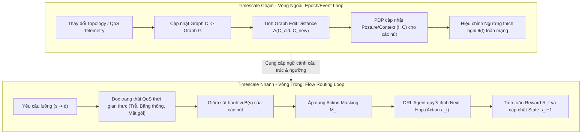

# Tài liệu Thiết kế Schema Dữ liệu Đầu vào và Huấn luyện DRL (ZT-SR-SDWAN)

Tài liệu này mô tả chi tiết schema dữ liệu huấn luyện, cấu trúc trạng thái (State), không gian hành động (Action), mặt nạ hành động (Action Masking), cơ chế phần thưởng (Reward), hàm chi phí định tuyến, và nguồn sinh dữ liệu dùng để huấn luyện tác tử Học sâu củng cố (**Deep Reinforcement Learning - DRL**) trong framework **ZT-SR-SDWAN**.

---

## 1. Kiến trúc Hai Tầng Thời gian (Two-Timescale Architecture)

Trong hệ thống định tuyến an toàn ZT-SR-SDWAN, dữ liệu không biến động cùng một tần suất. Hệ thống được thiết kế theo cấu trúc hai tầng thời gian để tối ưu hóa hiệu năng tính toán và độ ổn định của mạng:

### Phân loại các trường dữ liệu theo Timescale:

| Vòng cập nhật | Tần suất cập nhật | Các trường dữ liệu liên quan |
| :--- | :--- | :--- |
| **Vòng Chậm (Epoch/Event)** | Khi topology thay đổi hoặc theo chu kỳ kiểm tra cấu hình thiết bị | $\Delta(C_{\text{old}}, C_{\text{new}})$, Điểm danh tính $I(v)$, Điểm ngữ cảnh $C(v)$, 8 chỉ số Basta trên $C$, 8 chỉ số Basta trên $G$, Ngưỡng thích nghi $\theta(t)$, Cấu trúc Zone/Segment. |
| **Vòng Nhanh (Flow/Step)** | Tại mỗi flow request hoặc mỗi bước nhảy (hop) định tuyến | Trễ, Băng thông, Mất gói, Điểm hành vi thời gian thực $B(v)$, Quyết định hành động $a_t$, Vector Action Masking $M_t$, Tín hiệu phần thưởng $R_t$. |

---

## 2. Chi tiết Schema Dữ liệu Đầu vào (State, Mask, Action, Reward)

### A. Vector Trạng thái Đầy đủ (State $s_t$)
Tại mỗi bước quyết định $t$, tác tử DRL nhận một vector trạng thái $s_t$ tích hợp đầy đủ các đặc tính QoS và An ninh từ hai vòng timescale:

#### 1. Nhóm cấu trúc Phân vùng (Zone Topology)
*   **Zone_ID(v)**: Phân vùng logic của nút (DMZ, FIN, HR, IT, Core). Phản ánh độ nhạy cảm của tài nguyên tại nút đó.
*   **SegmentCrossing(u, v)**: Trường nhị phân ($1$ nếu đi xuyên qua ranh giới giữa hai phân vùng logic khác nhau, $0$ nếu đi nội vùng).

#### 2. Nhóm QoS Telemetry (Tầng 1 - Cập nhật nhanh)
*   **Latency(u, v)**: Độ trễ (ms) đo được thời gian thực trên liên kết $(u,v)$.
*   **Bandwidth(u, v)**: Băng thông khả dụng (Mbps) trên liên kết $(u,v)$.
*   **PacketLoss(u, v)**: Tỷ lệ mất gói tin (%) trên liên kết $(u,v)$.

#### 3. Nhóm Exposure Basta trên đồ thị C (Cập nhật chậm)
*   **AVOD(v)**: Average Out-Degree của zone chứa $v$ (độ phân tán trung bình).
*   **TINR(zone(v))**: Transitive Internal Network Reachability (khả năng tiếp cận bắc cầu).
*   **CL(v)**: Closeness Centrality của nút $v$ trên đồ thị connectivity $C$.
*   **ENICE**: Tổng số cạnh hoạt động (băng thông $>0$) trên đồ thị $C$.
*   **GCC**: Hệ số gom cụm toàn cục (Global Clustering Coefficient) trên $C$.
*   **CD**: Đường kính mạng (Diameter) của đồ thị $C$.
*   **MPL**: Chiều dài đường đi ngắn nhất trung bình (Mean Shortest Path Length) trên $C$.
*   **ACC**: Chỉ số trung tâm gần trung bình (Average Closeness Centrality) toàn cục trên $C$.

#### 4. Nhóm Robustness Basta trên đồ thị G (Cập nhật chậm)
*   **MOD(v)**: Max Out-Degree của nút $v$ trên đồ thị tấn công $G$.
*   **BN(v)**: Betweenness Centrality của nút $v$ trên đồ thị tấn công $G$.
*   **MSPL_current(G)**: Khoảng cách tấn công ngắn nhất từ entry (DMZ) đến target (FIN).
*   **NSP**: Tổng số đường đi đơn giản của hacker từ entry đến target trên $G$.
*   **CMC**: Độ phức tạp đường đi tới hạn (Average Path Length từ entry đến target trên $G$).
*   **AOD**: Bậc ra trung bình (Average Out-Degree) của các nút trên đồ thị tấn công $G$.
*   **CMPL**: Chiều dài đường dẫn tích lũy tối đa (Cumulative Maximum Path Length) trên $G$.
*   **ACC_G**: Chỉ số trung tâm gần trung bình của đồ thị tấn công $G$.

#### 5. Nhóm Biến động Mạng (Network Dynamics)
*   **$\Delta(C_{\text{old}}, C_{\text{new}})$ (Graph Edit Distance)**: Khoảng cách chỉnh sửa đồ thị giữa trạng thái connectivity trước và sau sự kiện cập nhật mạng (số lượng cạnh/đỉnh bị thêm hoặc xóa). GED giúp tác tử nhận biết phạm vi tác động cấu trúc mạng khi có sự thay đổi.

#### 6. Nhóm Trust & Posture chi tiết (Zero Trust - Tầng quyết định PDP)
*   **Identity Score $I(v, t)$**: Điểm tư thế an ninh và xác thực của nút.
*   **Behavior Score $B(v, t)$**: Điểm giám sát hành vi thời gian thực của nút.
*   **Context Score $C(v, t)$**: Điểm phơi nhiễm ngữ cảnh của nút ($1.0 - \text{normalize}(\text{AVOD})$).
*   **TrustScore $T(v, t)$**: Điểm tin cậy tổng hợp: $T(v, t) = \min(I(v, t), C(v, t), B(v, t))$.
*   **Ngưỡng động thích nghi $\theta(t)$**: Ngưỡng chuẩn an ninh toàn mạng tại bước thời gian hiện tại.

---

### B. Vector Mặt nạ Hành động (Action Masking $M_t$)
Action Masking $M_t$ là một vector nhị phân được tính toán tại mỗi bước $t$ để che giấu các hành động không hợp lệ trước khi đưa vào mô hình DRL:

$$M_t = [m_1, m_2, \dots, m_K] \quad \text{với } K = |V| \text{ (số nút trên mạng)}$$
$$m_i = 1 \iff \text{Nút } i \text{ là nút lân cận hợp lệ và thỏa mãn bộ lọc Hard Constraints}$$
$$m_i = 0 \iff \text{Bị loại bỏ hoàn toàn}$$

#### Cơ chế áp dụng Mask trong DRL:
Tác tử DRL sử dụng $M_t$ để áp lên lớp đầu ra (Logits) trước khi tính xác suất qua hàm Softmax:

$$\text{Logits}_{\text{masked}}(i) = \begin{cases} \text{Logits}(i) & \text{nếu } m_i = 1 \\ -\infty & \text{nếu } m_i = 0 \end{cases}$$
$$P(a_t = i \mid s_t) = \text{Softmax}\bigl(\text{Logits}_{\text{masked}}(i)\bigr)$$

Điều này đảm bảo mô hình hoàn toàn không thể lựa chọn các hành động vi phạm ZT, Micro-segmentation hay vượt ngưỡng an ninh cấu trúc.

---

### C. Hàm Chi phí Định tuyến và Hình phạt An ninh (Tầng Routing)
Đối với các thuật toán định tuyến so sánh (như SP-Routing, QoS-Routing, Seg-Routing, ZT-Routing), hàm chi phí tìm đường $f(a)$ cho một đường đi/hành động chọn đường đi $a$ được thiết lập như sau:

$$f(a) = \text{QoSCost}(a) + \beta_{\text{penalty}} \cdot \text{SecurityPenalty}(a)$$

Trong đó:
*   $\text{QoSCost}(a)$: Tổng chi phí QoS trên đường đi (ví dụ: tổng độ trễ $\sum \text{Delay}$ hoặc tổng nghịch đảo băng thông $\sum \frac{1}{\text{Bandwidth}}$).
*   $\text{SecurityPenalty}(a)$: Tổng hình phạt an ninh của các nút dọc theo đường đi:
    $$\text{SecurityPenalty}(a) = \sum_{v \in \text{path}(a)} \text{ExposurePenalty}(v)$$
*   **ExposurePenalty(v)**: Điểm phạt phơi nhiễm cấu trúc của nút $v$, tổng hợp từ các chỉ số Basta:
    $$\text{ExposurePenalty}(v) = w_1 \cdot \text{AVOD}(v) + w_2 \cdot \text{BN}(v) + w_3 \cdot \text{CL}(v)$$

---

### D. Tín hiệu Phần thưởng mở rộng (Reward $R_t$)
Phần thưởng huấn luyện của agent được thiết kế mở rộng để phạt hành vi làm suy yếu cấu trúc an toàn tổng thể của mạng:

$$R_t = \alpha \cdot \text{Throughput}(t) - \beta \cdot \text{Delay}(t) - \gamma \cdot \text{MaliciousPenalty}(p) + \mu \cdot \Delta\text{MSPL}(p) - \nu \cdot \text{NSP\_delta}(p)$$

*   **NSP_delta ($NSP_{\text{delta}}$)**: Sự thay đổi số lượng đường dẫn tấn công đơn giản của hacker từ DMZ đến FIN:
    $$\text{NSP\_delta} = \text{NSP}(G_{\text{new}}) - \text{NSP}(G_{\text{old}})$$
*   **Ý nghĩa**: Nếu hành động định tuyến (hoặc mở tunnel mới) làm tăng số lượng đường dẫn tấn công của hacker ($\text{NSP\_delta} > 0$), tác tử DRL sẽ bị phạt nặng ($\nu > 0$).

---

## 3. Bảng Tổng hợp Schema Dữ liệu Huấn luyện DRL

Bảng dưới đây chuẩn hóa toàn bộ các trường dữ liệu cấu thành một bản ghi huấn luyện (State, Action, Mask, Reward, Next State):

| Nhóm trường | Tên trường cụ thể | Kiểu dữ liệu | Tần suất cập nhật (Timescale) | Nguồn sinh / Cách tính |
| :--- | :--- | :--- | :--- | :--- |
| **State $s_t$** | `Zone_ID` | Categorical | Chậm (Epoch) | Tĩnh theo sơ đồ phân vùng ban đầu |
| | `SegmentCrossing` | Binary | Nhanh (Flow) | So sánh Zone giữa nút nguồn và đích |
| | `Latency`, `Bandwidth`, `PacketLoss` | Float | Nhanh (Flow) | Thu thập từ Tầng 1 / Telemetry probe |
| | `AVOD`, `TINR`, `CL`, `ENICE`, `GCC`, `CD`, `MPL`, `ACC` | Float | Chậm (Epoch) | Tính toán bằng NetworkX trên đồ thị overlay $C$ |
| | `MOD`, `BN`, `MSPL_current`, `NSP`, `CMC`, `AOD`, `CMPL`, `ACC_G` | Float | Chậm (Epoch) | Tính toán bằng NetworkX trên đồ thị tấn công $G$ |
| | `Graph_Edit_Distance_Delta` | Float | Chậm (Epoch) | Đo sự sai khác cấu trúc $\Delta(C_{\text{old}}, C_{\text{new}})$ |
| | `Identity_I`, `Behavior_B`, `Context_C`, `Trust_T` | Float | Nhanh / Chậm | [PDP](file:///d:/SD_WAN_Secure_Routing/zt_sr_sdwan/src/trust/pdp.py#L8) tổng hợp từ Posture, Anomaly và AVOD |
| | `theta` | Float | Chậm (Epoch) | Ngưỡng động thích nghi $\theta(t) = \mu_T(t) + k \cdot \sigma_T(t)$ |
| **Mask $M_t$** | `Action_Mask_Vector` | Binary List | Nhanh (Flow) | Lọc lân cận qua Hard Constraints (Trust & Outlier) |
| **Action $a_t$** | `next_hop_chosen` | Integer / ID | Nhanh (Flow) | Quyết định chọn hop tiếp theo của DRL Agent |
| **Reward $R_t$** | `reward_signal` | Float | Nhanh (Flow) | Tính toán sau mỗi bước qua QoS, Penalty và $\text{NSP}_{\text{delta}}$ |
| **Next State $s_{t+1}$**| `next_state_vector` | Float List | Nhanh (Flow) | Trạng thái mạng quan sát được sau khi thực thi hành động |

---

## 4. Giải trình tính "Thực tế" (Realism) trước Hội đồng phản biện

Để thuyết phục Hội đồng về độ tin cậy của mô phỏng, framework áp dụng các cơ chế ánh xạ dữ liệu thực tế sau:

### 1. Phân vùng mạng Doanh nghiệp thực tế
Sơ đồ mạng được chia thành 5 phân vùng logic theo mô hình Zero Trust:
*   **Core (Backbone)**: Vùng truyền dẫn lõi trung tâm kết nối các site.
*   **DMZ (Public Services)**: Vùng chứa máy chủ Web, Portal hướng Internet, điểm tiếp nhận truy cập (Entry).
*   **FIN (Financial Database)**: Phân vùng bảo mật cao nhất, lưu trữ CSDL tài chính/giao dịch (Target).
*   **HR (Human Resources Workstations)**: Phân vùng trạm làm việc của nhân viên nhân sự.
*   **IT (Admin Zone)**: Phân vùng quản trị hệ thống, vận hành hạ tầng.

### 2. Dữ liệu Lỗ hổng bảo mật CVE và điểm số CVSS thật
Hệ thống không sinh ngẫu nhiên điểm số lỗ hổng bảo mật. Điểm Posture $I(v)$ được ánh xạ trực tiếp từ các mã lỗ hổng bảo mật CVE thực tế dựa trên loại thiết bị giả định:
*   *Thiết bị DMZ*: Gán lỗ hổng CVE-2021-44228 (Log4Shell, điểm **CVSS = 10.0**).
*   *Thiết bị FIN*: Gán lỗ hổng CVE-2020-14750 (Oracle WebLogic, điểm **CVSS = 9.8**).
*   *Thiết bị HR/IT*: Gán lỗ hổng CVE-2021-34527 (PrintNightmare, điểm **CVSS = 8.8**).

### 3. Kịch bản Tiêm tấn công động (Dynamic Attack Injection)
*   **Insider Threat**: Hệ thống lập lịch tiêm sự cố tại một thời điểm xác định, tăng đột biến chỉ số bất thường hành vi $AnomalyScore(v)$ của một nút nội bộ (ví dụ: nút HR quét cổng bất thường). PDP ghi nhận sự thay đổi của Behavior Score $B(v)$ làm Trust Score sụt giảm xuống dưới ngưỡng $\theta(t)$, kích hoạt Action Masking $M_t$ cô lập nút đó thời gian thực.
*   **Lateral Movement**: Tấn công di chuyển ngang từ DMZ sang các phân vùng lân cận làm thay đổi cấu trúc đồ thị tấn công $G$ (ví dụ: làm tăng chỉ số Betweenness Centrality $BN$ và Max Out-Degree $MOD$ của các nút trung gian), buộc tác tử DRL nhận biết rủi ro cấu trúc và chọn đường đi vòng an toàn hơn.
